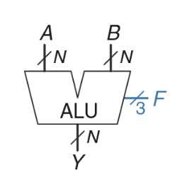
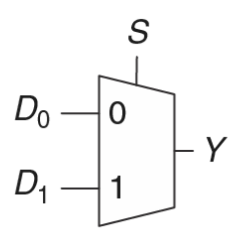
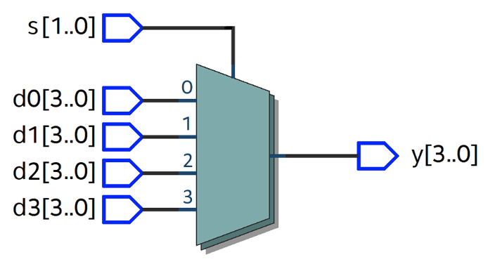
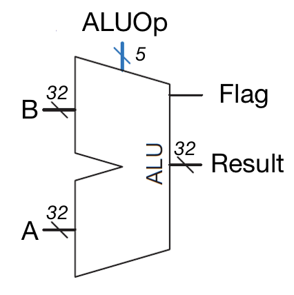
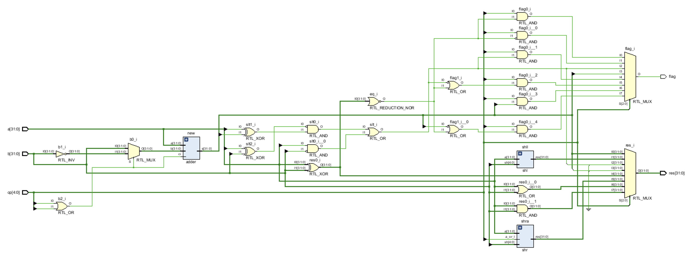

# Лабораторная работа 1. Арифметико-логическое устройство

[`Список лабораторных`](../README.md) [`СОДЕРЖАНИЕ`](../../README.md)

Так как основной задачей процессора является обработка цифровых данных, одним из его основных блоков является арифметико-логическое устройство (АЛУ). Задача АЛУ производить над входными данным арифметические и поразрядно-логические операции.

## Цель

На языке Verilog описать блок арифметико-логического устройство (АЛУ) и подтвердить правильность работы с помощью тестового окружения.


## Общий ход работы

1. Изучить устройство и принцип работы АЛУ
2. Изучить языковые конструкции verilog для реализации АЛУ
3. Внимательно ознакомиться с заданием
4. Описать АЛУ на языке verilog
5. Реализовать тестовое окружение для АЛУ

[необходимый минимум, дальнейшее для тех, кто успевает и хочет проверить работу на стенде]

6. Подключить к проекту файл констрейнов (прописать какие входы/выходы АЛУ каким ножкам ПЛИС соответствуют)
7. Проверить работу АЛУ на ПЛИС


## Теория

---




## Инструменты

Как было сказано выше, АЛУ можно реализовать мультиплексируя результаты нескольких операционных устройств. На языке verilog можно описать мультиплексор с произвольным количеством входов используя вложенные тернарные операторы `x ? t : f`, либо конструкцию `case`. 



``` verilog
  assign Y = S ? 
```



``` verilog
module mux4in1 (
  input       [1:0] s,
  input       [3:0] d0, d1, d2, d3,
  output  reg [3:0] y
);

  always @ *  // begin не стоит потому, что 
    case (s)
      2'b00: y = d0;
      2'b01: y = d1;
      2'b10: y = d2;
      2'b11: y = d3;
    endcase

endmodule
```

Рассмотрим еще один пример. 

``` verilog
  //...
    input       [3:0]  ctrl,
    output reg  [7:0]  out
  //...

  always @ * begin
    case (ctrl)
      4'b0000: out = 8'b10101010;
      4'b1001: out = 8'b01010101;
		//...
      default: out = 8'b0;
    endcase
  end
  //...
```

Очень удобным оказывается использование определений ``define` когда некоторая константа должна использоваться в нескольких местах. Если ее описать через 

``` verilog
`define 
```

[`Тестовые окружения`](../../Other/Testbench.md)

---

## Задание






---

### Порядок выполнения задания

