# Лекция 22. Системы общего назначения

## Микропроцессоры

Для начала мы повторим классифицирование микропроцессоров.

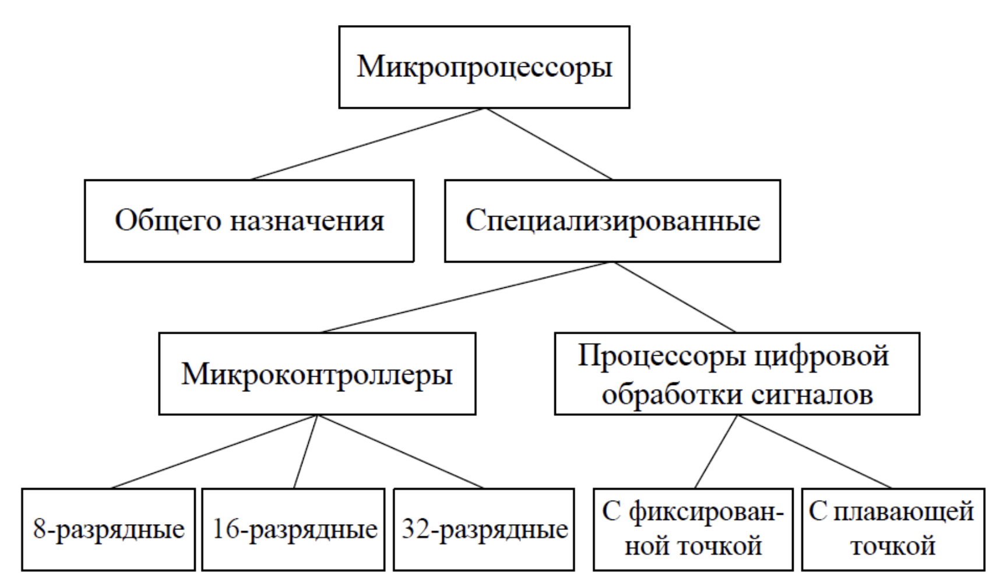

*Рис. 1. Классификация микропроцессоров.*

**Микропроцессоры общего назначения** – нужны для решения любых задач, он не предназначен для специализированных задач. Для них мы используем **специализированные микропроцессоры**.

**Специализированные микропроцессоры** – альтернатива, которую мы можем разделить на **микроконтроллеры** и **процессоры цифровой обработки сигналов**. Про микроконтроллеры мы подробнее поговорили на прошлой лекции.

**Процессоры цифровой обработки сигналов** – фактически это те же **микроконтроллеры**, но они больше ориентированы на цифровую обработку сигналов.

В этой лекции мы рассмотрим процессоры общего назначения.

## История x86

Процессоры архитектуры **x86** имеют архитектуру с полным набором команд, то есть поддерживает большое количество инструкций с разной шириной.

Впервые архитектура **x86** была представлена компанией Intel в 1978 году (Intel **8086**). Следующие версии **8086** стали совершенствовать первую версию добавлением новых инструкций, таймеров, контроллеров, защищенных режимов и т.д. Полный список представлен в таблице 1.

| Версия      |                       Что было добавлено                        | Год выпуска |
|:------------|:---------------------------------------------------------------:|:-----------:|
| Intel 8086  |          16-битный, 98 инструкций, 7 режимов адресации          |    1978     |
| Intel 80186 |     Новые инструкции, КПДП, таймеры, контроллер прерывания      |    1982     | 
| Intel 80286 |              Защищенный режим, виртуальная память               |    1982     |
| Intel 80386 |        32-битный, страничная организация, до 4 Гб памяти        |    1985     | 
| Intel 80486 |                   Сопроцессор, 150 инструкций                   |    1989     |
| P6          | Суперскалярный CISC, RISC-ядро, предсказание условных переходов |    1995     | 
| MMX         |  **M**ulti**m**edia E**x**tensions (мультимедийные расширения)  |    1997     |

*Таблица 1. Развитие процессора Intel 8086.*

## Тик-так
Когда Intel делают свои процессоры они используют подход **"Тик-так"**. Суть его заключается в том, что они в одном году разрабатывают новую архитектуру (**тик**), а в следующем осваивают новый тех. процесс (**так**). По картинке можно увидеть как работал **"Тик-так"** до 2015 года, сейчас это работает немного "криво", но общая идея понятна.

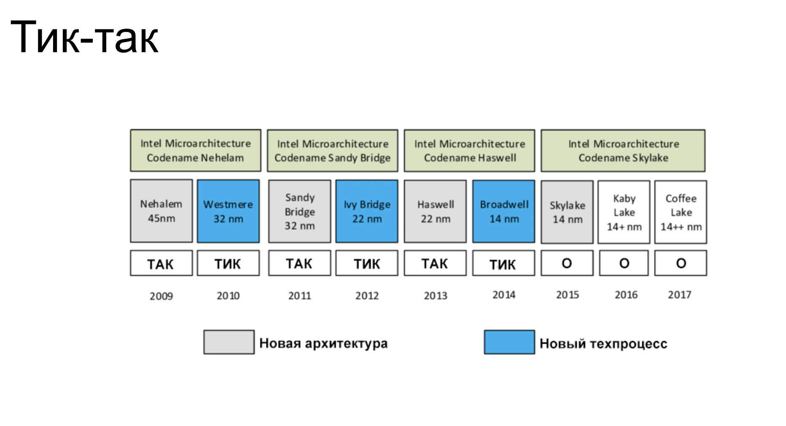

*Рис. 2. Подход Тик-так.*

## Coffee lake
Посмотрим на конкретный пример архитектуры **x86** – **Coffee lake** реализованный в 2017 году. 
Изучим его микроархитектуру. Она состоит из трех основных блоков: **подсистема памяти**, **Execution Engine**, **Front-end** (который является CISC оболочкой) 

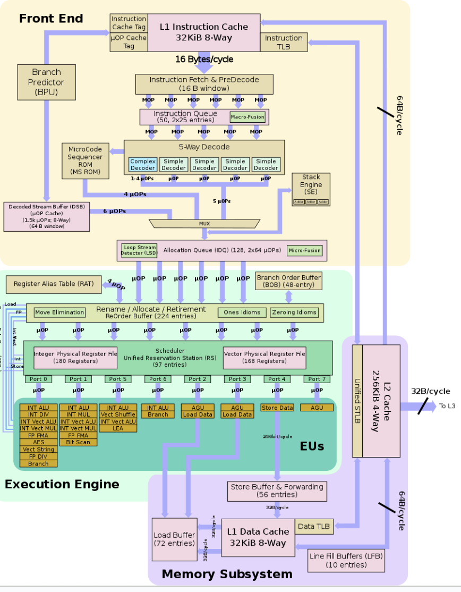

*Рис. 3. Микроархитектура Coffee Lake.*

Разберём каждый блок подробнее:
### **_Front-end_** 
1. Из **кеш-памяти** за один такт считывается сразу 16 байт и попадают в блок **Instruction Fetch**, где определяется в каком порядке необходимо выполнять полученные инструкции (количество инструкций зависит от того сколько они будут занимать байт).

2. Из блока **Instruction Fetch** выходят до 6 макро-операций CISC инструкций в блок очереди инструкций, где благодаря **Macro-Fusion** некоторые инструкции объединяются (только если это допустимо).

3. Из **Instruction Queue** выходит 5 макро инструкций (с учётом того, что некоторые могли быть объеденины в одну), и попадают в **5-Way Decode (пяти секционный дешифратор)**.

4. **Пяти секционный дешифратор** преобразует макро операции CISC инструкции в RISC инструкции. Отсюда разные макро инструкции транслируются в разную последовательность микро инструкций (инструкции для RISC процессора). Простые инструкции попадают в **Simple Decoder** и преобразуются в одну микро инструкцию. Более сложные попадают в **Complex Decoder**. Ещё сложнее инструкции ссылаются на память микропрограмм **MicroCode Sequencer**. Помимо всего здесь подключен **Stack Engine**, чтобы меньше обращаться к основной памяти - пока этот стек не заполнен вызов подпрограмм и сохранение информации будет происходить на этом стеке. Также мы имеем **Branch Predictor**, который связан с кэшем и **Decoded Stream Buffer**, сохраняющий уже использованные инструкции, чтобы повторно их не декодировать. 

5. В блоке **MUX** мы имеем набор инструкций, которые уже нужно выполнить. От туда они попадают в **Allocation Queue**, где мы также имеем **Micro-Fusion** для дополнительной доработки микро инструкций. **Loop Stream Detector** необходим для запоминания последних 18 инструкций и определяет есть ли цикл. Из этого блока мы переходим к **Execution Engine**.

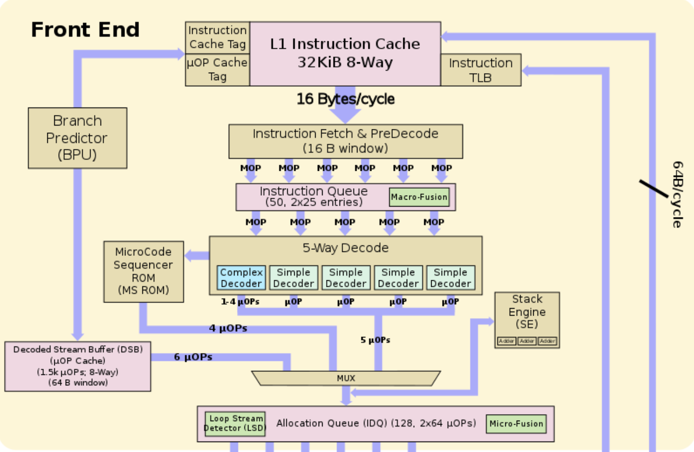

*Рис. 4. Front-end Coffee Lake.*

### **_Execution Engine_** 
1.  **ReOrder Buffer** получает инструкции и переименовывает их регистры, чтобы избежать конфликтов. Из блока **ReOrder Buffer** выходят микро инструкции с известными адресами куда они будут сохранены, переименованными регистрами и т.д. Они попадают в **Scheduler Unified Reservation Station**

2. В **Scheduler Unified Reservation Station** происходит диспетчеризация, то есть микро инструкции раздаются на различные порты. На выходе каждого порта стоят функциональные блоки (**EUs - Execution Units**). Каждый из них выполняет свои задачи - целочисленное ALU, целочисленное деление, векторные операции и т.п. Некоторые из этих блоков подключены к подсистеме **Memory Subsystem**, о которой будет рассказано в следующем параграфе.

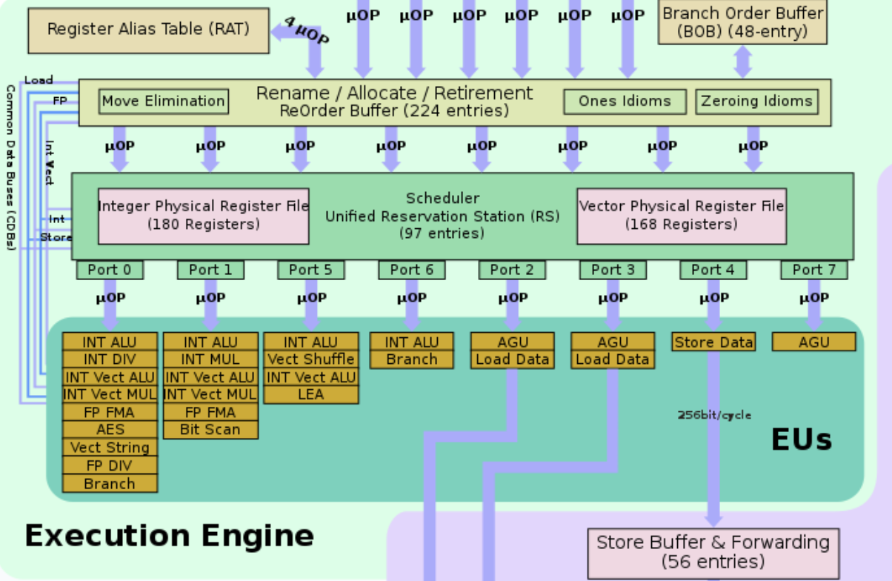

*Рис. 5. Execution Engine Coffee Lake.*

**Memory Subsystem** – подсистема памяти. Данные попадают в **Load Buffer** и **Store Buffer**, подключенные к кешу первого уровня **L1 Data Cache**, который в свою очередь передаёт всё в кеш второго уровня. **L2 Cache** уже является общим для команд и для данных.

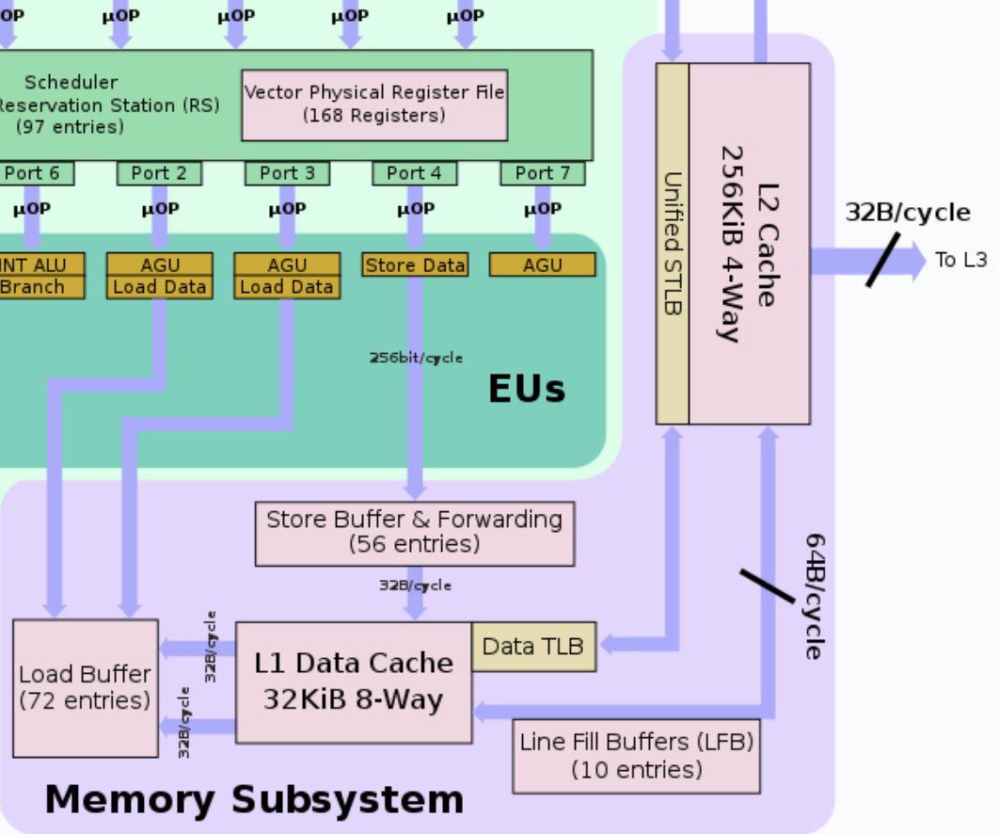

*Рис. 6. Memory Subsystem Coffee Lake.*

На рисунке 7 можно увидеть связь основных блоков Coffee Lake и общую микроархитектуру.

Выше мы рассмотрели одно ядро. **Coffee Lake** может иметь 4, 6 и 8 ядер (на рисунке 8 представлен 4-ядерный процессор). Подсистемы памяти каждого ядра объединяются в **кольцевую шину**.  **Кольцевая шина** передаёт информацию по кругу, благодаря чему устраняются конфликты, допустим когда несколько устройств хотят завладеть шиной. В правой части находится **System Agent**. Он связан с взаимодействием с памятью, дисплеем и другими внешними устройствами.

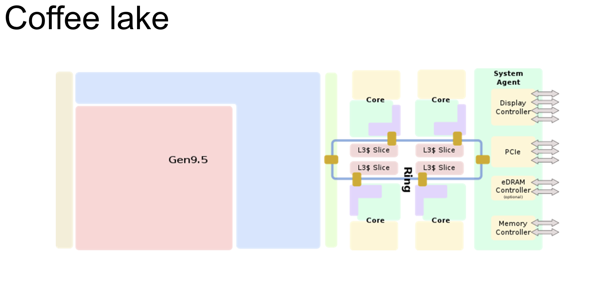

*Рис. 8. четырёхъядерный процессор Coffee Lake.*

Метод **кольцевой шины** имеет и минусы – если её расширять, то её пропускная способность падает.

## Gen9.5
**Gen9.5** – графическое ядро. Оно состоит из 
* **Command Streamer** – устройство, которое управляет потоком исполнения.
* **EU (Execution Unit)** – исполнительные устройства, производящие вычисления.

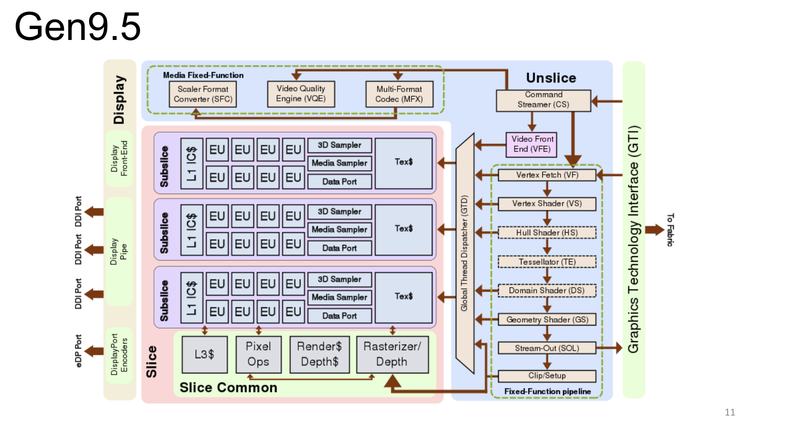

*Рис. 9. Графическое ядро Gen9.5.*

## AMD Zen
Для сравнения рассмотрим микро архитектуру **AMD Zen**. Многие блоки совпадают с **Coffee Lake**, поэтому акцентируем внимание на отличиях: в данной реализации инструкции сортируются в зависимости от того целочисленные они (Integer) или с плавающей запятой (FP/SIMD). Этот пример используется в ознакомительных целях - показать, что есть и другие микро архитектуры.

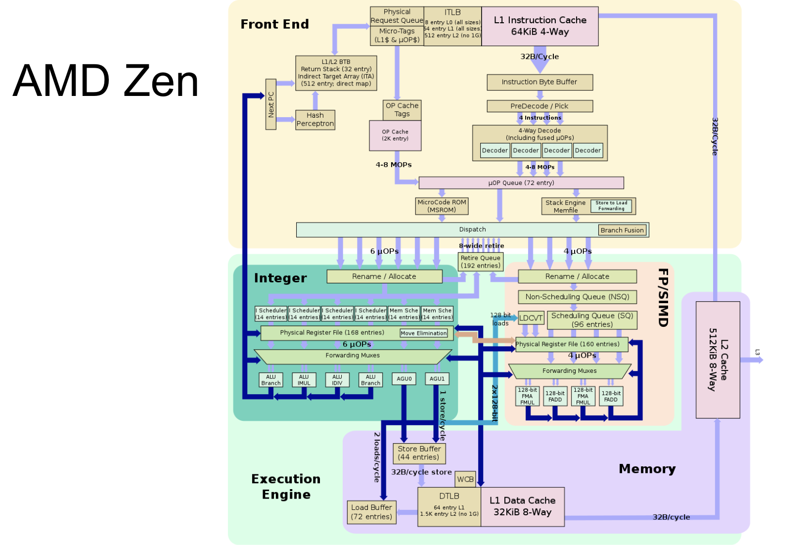

*Рис. 10. Микроархитектура AMD Zen.*

## Из чего состоит компьютер?
**Компьютер** - Электронно-вычислительная машина (ЭВМ); программно-аппаратный комплекс для обработки больших объемов информации при решении различного рода задач.

Выйдем на уровень системы. То что мы смотрели в прошлых параграфах - **центрально процессорное устройство (CPU)**. Сейчас же мы разберём из чего в целом состоит компьютер:
* **ЦПУ (Центральное Процессорное Устройство)**
* **Генератор тактовых импульсов**
* **Чипсет** – он состоит из одной или двух микросхем (северного и южного моста). 

**Северный мост** – это контроллер-концентратор памяти, который взаимодействует с памятью и графическими адаптерами. Чтобы ускорить общение с высокоскоростной шиной в современных процессорах северных мост стали встраивать в **ЦПУ**.

**Южный мост** – контроллер-концентратор ввода-вывода, который связан с менее быстрыми устройствами (BIOS, PCI и периферия).

**BIOS** – базовая система ввода-вывода. С загрузки **BIOS** начинается включение компьютера: **BIOS** копирует свою программу в основную память и отдаёт её процессору управления, чтобы **ЦПУ** проверило какое оборудование подключено, как его необходимо сконфигурировать и в рабочем ли состоянии оно находится (т.е. сканирует и конфигурирует систему).

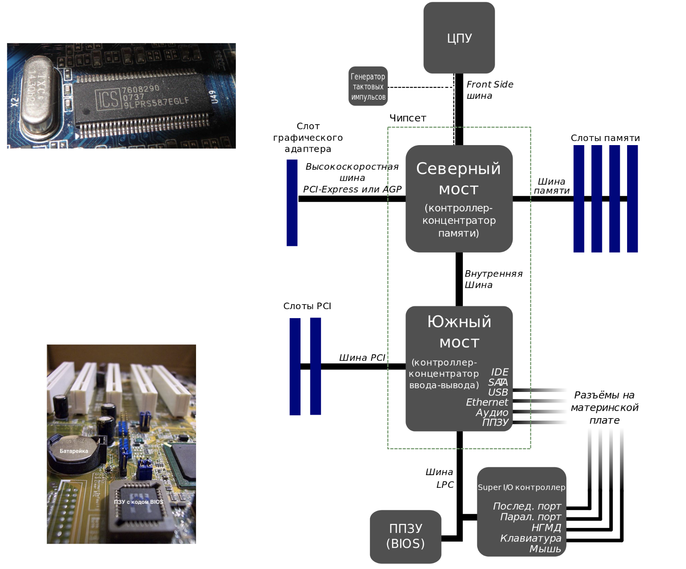

*Рис. 11. Материнская плата в схематичном варианте.*

На рис. 12 представлена иллюстрация расположения **северного** и **южного моста** на материнской плате.
Как видно **северный мост** находится ближе к процессору, а **южный** к периферии, USB и т.п. 

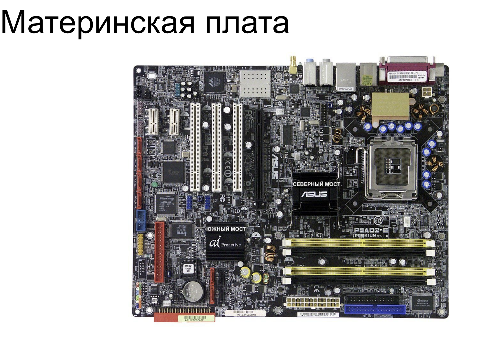

*Рис. 12. Материнская плата.*

## Основные материалы лекции
1. [Ссылка](https://www.youtube.com/watch?v=w7CcAgTtL6k&list=PL0def37HEo5KHPjwK7A5bd4RJGg4djPVf&index=22) на видеозапись лекции