# Лекция 23. Параллельные вычислительные системы

**Параллельные вычислительные системы (ПВС)** нужны для повышения производительности, чтобы выполнять вычисления как можно быстрее за счёт того, что каждое ядро решает свои задачи. Однако параллелизм бывает разный, об этом и рассказывается в рамках этой лекции.
## Классификация
### По области применения

- **Научные вычисления (grand challenges)** – к ним относятся обработка больших данных, моделирование взрыва ядерных бомб, вычисления сложности алгоритмов и т.п. 

- **Глобальные корпоративные вычисления**, которые делятся на две подкатегории 
  - Обработка баз данных корпораций
  - Многопоточная обработка запросов

### По особенностям назначения

- **Системы высокой надежности** – к ним относятся банковские системы и другие системы для которых надёжность является один из главых факторов. Эта система является избыточной, так как ей необходима горячая замена различных ресурсов (элементов памяти, процессоров и т.п.), в случае если что-то выйдет из строя.

- **Системы высокопроизводительных вычислений** – название говорит само за себя, это процессоры нацеленные на высокопроизводительные вычисления.

- **Многопоточные системы** – к ним относятся различные web-сервера, которым нужно одновременно отвечать на множество запросов, когда люди заходят на сайт.

## Классификация Флинна

**Классификация Флинна** – общая классификация архитектур ЭВМ по признакам наличия параллелизма в потоках команд и данных. Была предложена Майклом Флинном в 1966 году и расширена в 1972 году.
Её идея заключалась в том, чтобы представить машину как обработчик потока команд и потока данных, и в зависимости от того какие потоки команд и данных обрабатывает машина, классифицировать её одним из 4 способов: 

- **SISD (Single Instruction Single Data)** (на одиночный поток команд приходится одиночный поток данных) – это традиционный процессор (к примеру однотактный). Каждой команде соответствует своя порция данных, она обрабатывается процессором, который выдаёт результат.

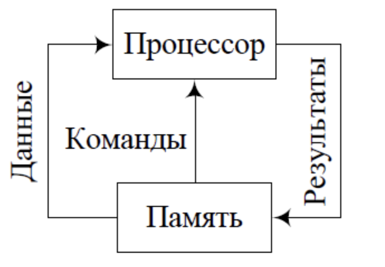

*Рис. 1. SISD (Single Instruction Single Data).*

- **SIMD (Single Instruction Multiple Data)** (на одиночный поток команд приходится множественный поток данных) – он состоит из памяти программ, которая выдаёт одну инструкцию и эта инструкция является указанием всем вычислителям в системе, чтобы они каждый работали над своей порцией данных.

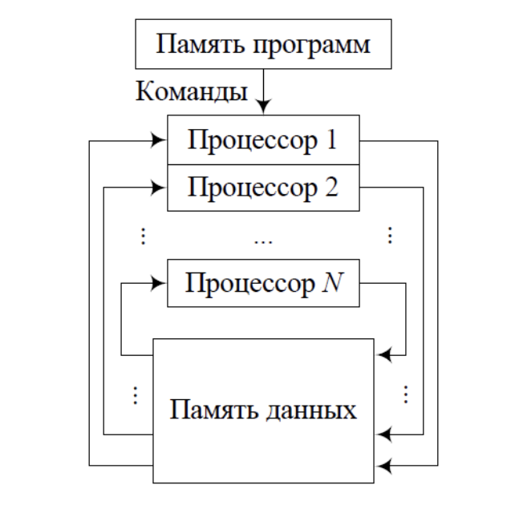

*Рис. 2. SIMD (Single Instruction Multiple Data).*

- **MISD (Multiple Instruction Single Data)** (на множественный поток инструкций единственные данные) – это конвейер, то есть одна порция данных проходит через конвейер (формально это одна команда, которая разбита на стадии).

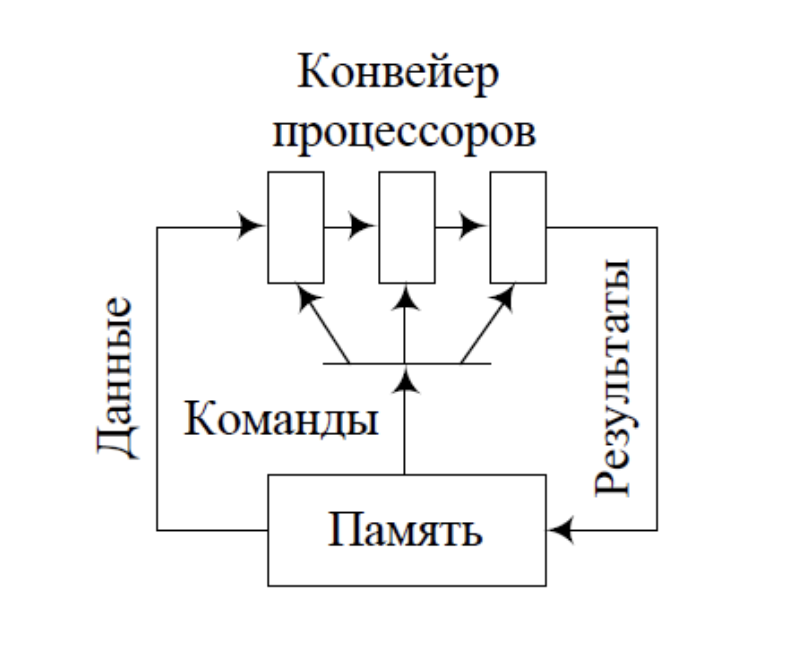

*Рис. 3. MISD (Multiple Instruction Single Data).*

- **MIMD (Multiple Instruction Multiple Data)** (множественный поток инструкций для различных данных) – при таком подходе можно одновременно генерировать множество команд для различных данных и получать различные результаты на выходе.

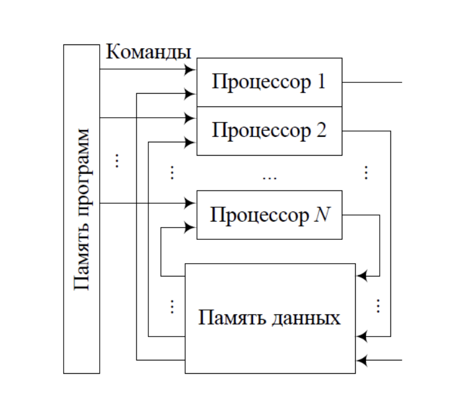

*Рис. 4. MIMD (Multiple Instruction Multiple Data).*

## Альтернативная классификация

Эта классификация основывается на **классификации Флинна** и расширяет её.

- **Системы с конвейерной и векторной обработкой** – похоже на работу **SIMD**, но использующие векторные системы.

- **SIMD-системы** – такие системы с процессорными элементы, которыми управляет один процессор.

- **MIMD-системы**
  - Сильносвязанные (с общей памятью) – если программа лежит в общей памяти.
  - Слабосвязанные (с локальной памятью) – архитектура, в которой передача информации между отдельными элементами этой системы происходит за счёт передачи явных сообщений.

- **Multiple SIMD** – объединений SIMD процессоров.

## Классификация по памяти

- **Symmetric Multiprocessing (SMP)** – системы с однотипными процессорами и общей памятью. Их преимущества: легкое и быстрое общение между процессорами, но они плохо поддаются масштабированию, что является частой задачей.
На рисунке 5 показан классический вариант реализации **SMP**

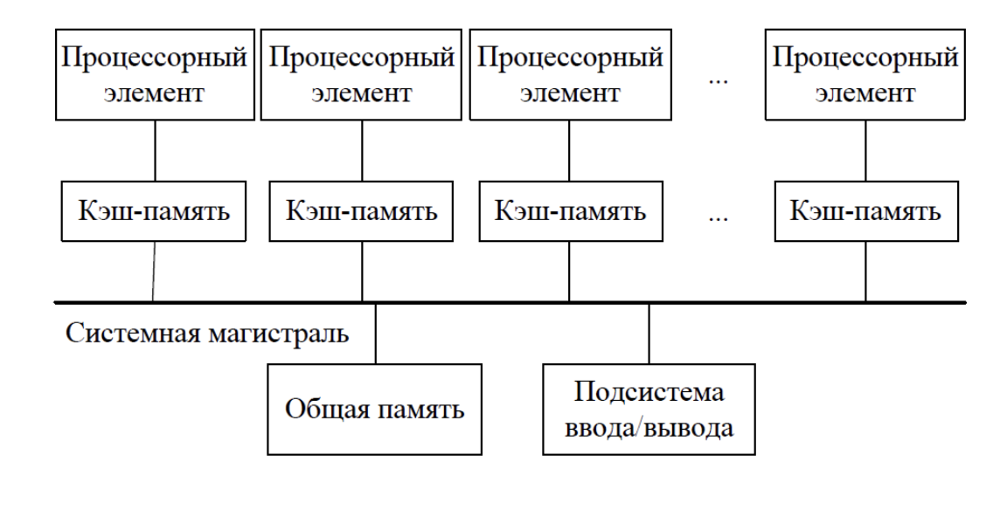

*Рис. 5. Symmetric Multiprocessing (SMP).*

**SMP** может быть реализован по другому - один из вариантов это перекрёстное подключение, когда каждый из элементов может обращаться к своим модулям, но такая реализация достаточно сложна и требует больших аппаратных затрат.

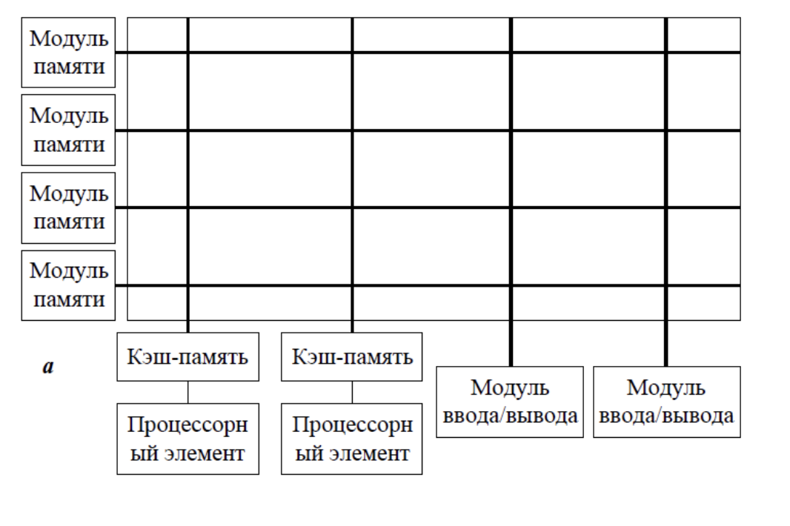

*Рис. 6. Symmetric Multiprocessing (SMP) с перекрёстным подключением.*

Также есть вариант с коммутаторами, благодаря которым происходит маршрутизация запросов. Это попытка сделать вариант SMP с перекрёстным подключением, но чуть более в упрощённом варианте.

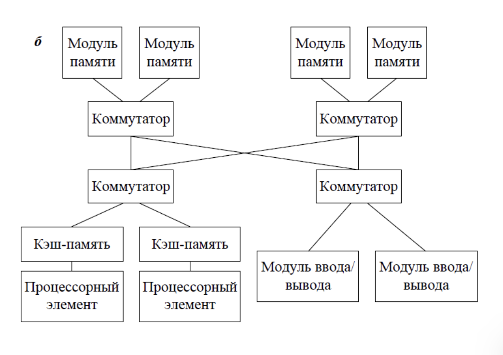

*Рис. 7. Symmetric Multiprocessing (SMP) с коммутаторами.*

- **Message Passing Architecture (MPA)** – архитектура с передачей сообщений через высокоскоростную коммутационную среду. Она сложнее организуется, но она проще масштабируется, а также является гетерогенной, то есть может использовать разные процессоры, в том числе с разной архитектурой.

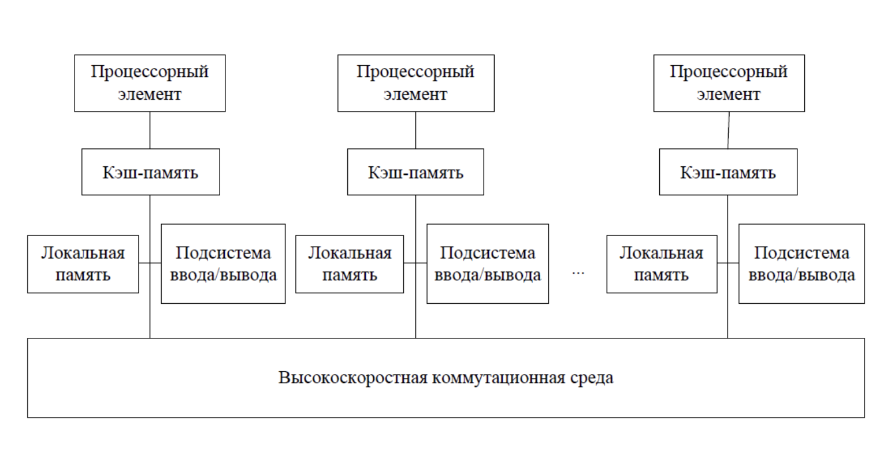

*Рис. 8. Message Passing Architecture (MPA).*

- **Non-Uniform Memory Access (NUMA)** – архитектура, которая в качестве реализации выглядит как система с общей памятью, то есть у всех процессоров есть общая память и они могут писать в любой адрес, но на самом деле она такой не является - у каждого устройства своя локальная память, но за счёт общих коммутаторов, для отдельного процессора это выглядит как единая память. 

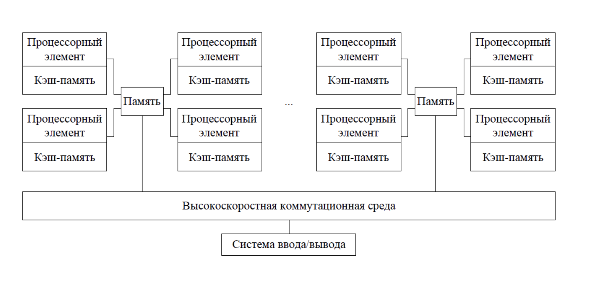

*Рис. 9. Non-Uniform Memory Access (NUMA).*

### Обобщенная структура параллельно вычислительной системы

Обобщенно структуру **параллельно вычислительной системы (ПВС)** можно изобразить следующим образом: есть высокоскоростная коммутационная среда, которая подключает различные вычислительные узлы. Каждый вычислительный узел это набор процессорных элементов, которые подключены к коммутатору, соединяющий их с памятью.

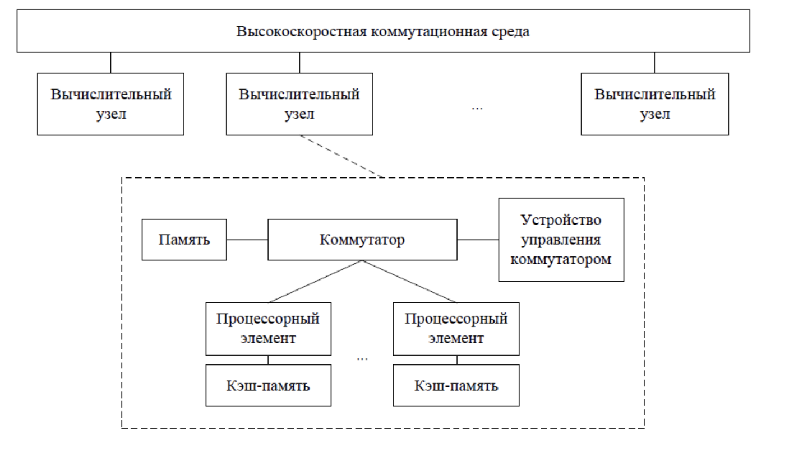

*Рис. 10. Обобщенная структура ПВС.*

## Матричные вычислительные системы

Матричные вычислительные системы относятся к **SIMD** системам. Они состоят из набора процессоров, имеющих свою локальную память и коммутационную среду с помощью которой процессоры общаются друг с другом. Также есть высокопроизводительный управляющий процессор, он считывает программу и выставляет задачу процессорам (в том числе и их активацию). На рисунке 11 представлена такая реализация.

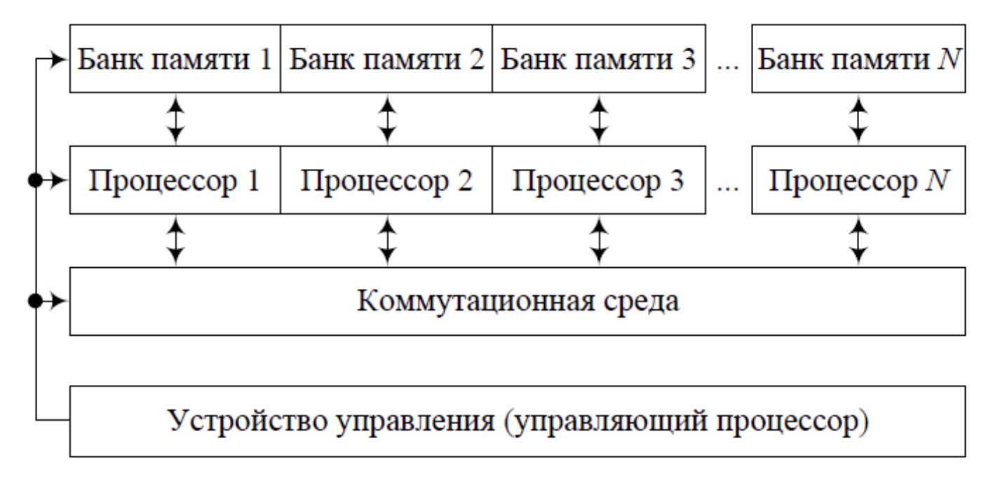

*Рис. 11. Первый способ реализации матричной вычислительной системы.*

На рисунке 12 представлен другой способ реализации, где процессоры не на прямую подключены к своему банку памяти, а через коммутационную среду. То есть процессоры могут обращаться к другим банкам памяти, это увеличивает гибкость матричного вычислителя, но также значительно его усложняет. 

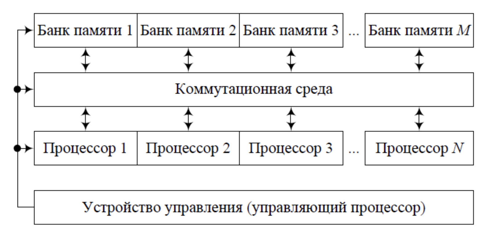

*Рис. 12. Второй способ реализации матричной вычислительной системы.*

## Кластерные вычислительные системы (ВС)

**Кластеры** – объединений гетерогенных структур для решения общей задачи под единым программным обеспечением. 

Преимущества кластерных вычислительных систем:

- **абсолютная масштабируемость** – можно изначально создать огромный кластер.
- **наращиваемая масштабируемость** – кластер можно продолжать масштабировать.
- **высокий коэффициент готовности** – за счёт того, что уже есть большое количество машин.
- **соотношение цена/производительность** – кластеры значительно выигрывают в цене по сравнению с другими параллельными вычислительными системами.

На рисунке 13 представлены две реализации **кластерных вычислительных систем**. Слева представлена реализация с общим дисковым массивом, справа же системы связаны только высокоскоростной магистралью.

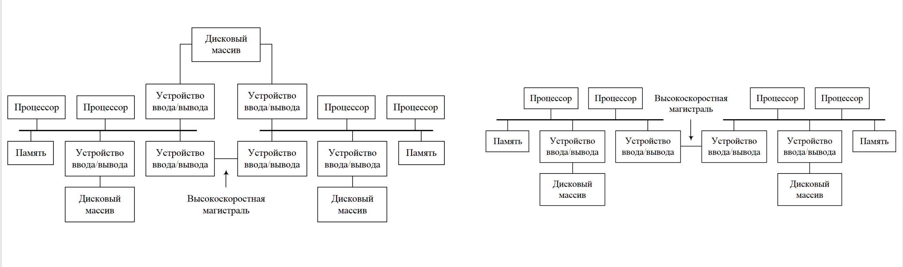

*Рис. 13. Кластерные вычислительные системы.*

## Топология малых кластеров

На рисунке 14 представлены разные реализации малых кластеров. Самый простой – под номером 4, у каждого узла есть свой дисковый массив. Остальные варианты для надёжности: 
- Вариант под номером 1 – перекрёстный. За счёт такого перекрёстного подключения ресурсы дублируются, и есть возможность заменить один из узлов в случае, если он выйдет из строя.
- Вариант под номером 2 – N+M. Благодаря коммутатору каждый узел кластера имеет возможность получить доступ к любому дисковому массиву.
- Вариант под номером 3 – N+1. Здесь есть один узел, который создаёт избыточность и страхует если какой-то из узлов выйдет из строя.

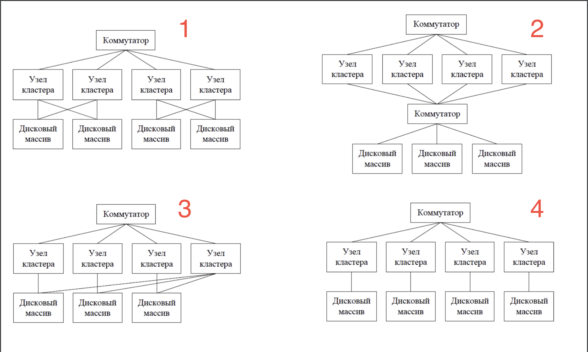

*Рис. 14. Кластерные вычислительные системы.*

## Реконфигурируемые вычислительные системы

**Реконфигурируемые вычислительные системы (РВС)** — это системы, имеющие возможность менять свою модель вычислений, или, иначе говоря, позволяющие вносить существенные изменения в свою аппаратную часть. Основное отличие это наличие **программируемой логической интегральной схемы (ПЛИС)** и возможность по мере необходимости реконфигурировать **ПЛИС** компьютером. Благодаря **ПЛИС** данные обрабатываются потоково.

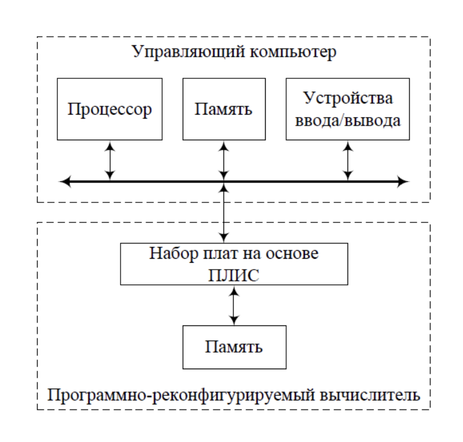

*Рис. 15. Реконфигурируемые вычислительные системы.*

## Систолические вычислительные системы

Систолические вычислительные системы – системы класса **SIMD**, основным принципом которых является то, что все данные регулярно и ритмически проходящие через массив, используются многократно. Она состоит из цепочки процессорных элементов, которые поэтапно взаимодействуют между собой. Важное отличие, что здесь не происходит обращение к памяти.

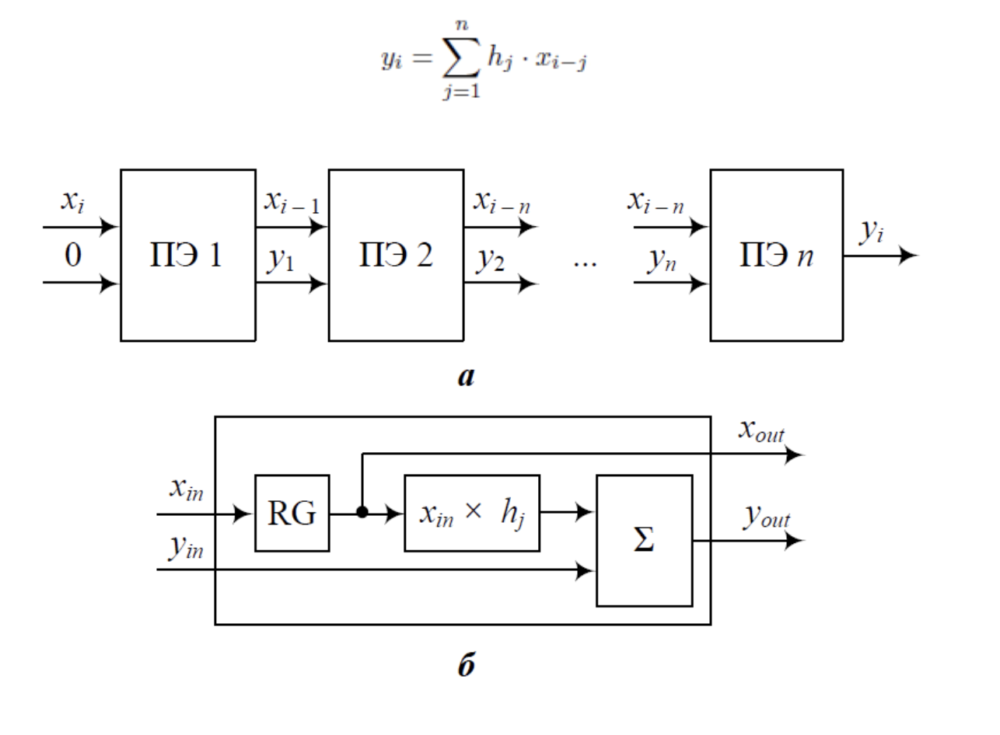

*Рис. 16. Систолические вычислительные системы.*

## Системы, управляемые потоками данных

Мы привыкли, что обычно машина управляется потоком команд - пришла команда и она выполняется. Но сейчас мы рассмотрим другой подход.

Идея **систем, управляемых потоком данных** заключается в том, что не новая инструкция порождает новые вычисления, а готовые данные порождают новые вычисления.

Чтобы разобраться, как работает данная система, рассмотрим элементы описания этой машины, представленной на рисунке 17.

Принцип работы будет описан в виде направленного графа, где по стрелочкам идут данные, в кружочках обозначаются операции:

- а – бинарная операция
- б – унарная операция
- в – разветвление
- г – объединение
- д – мультиплексор
- е – проверка на True
- ж – проверка на False
- з – арбитр (кто первый придёт – направо, второй – налево)

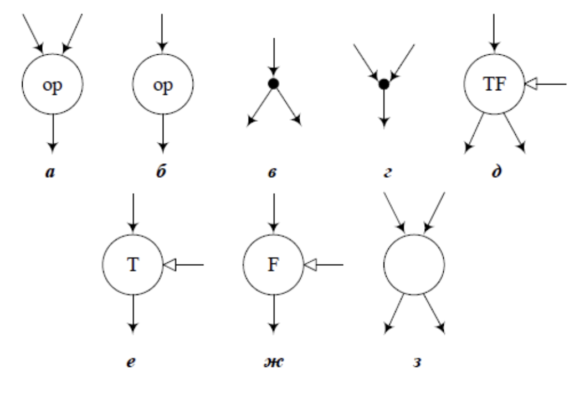

*Рис. 17. Элементы системы, управляемые потоками данных.*

Рассмотрим работу **систем, управляемых потоком данных** на примере решения корней квадратного уравнения.

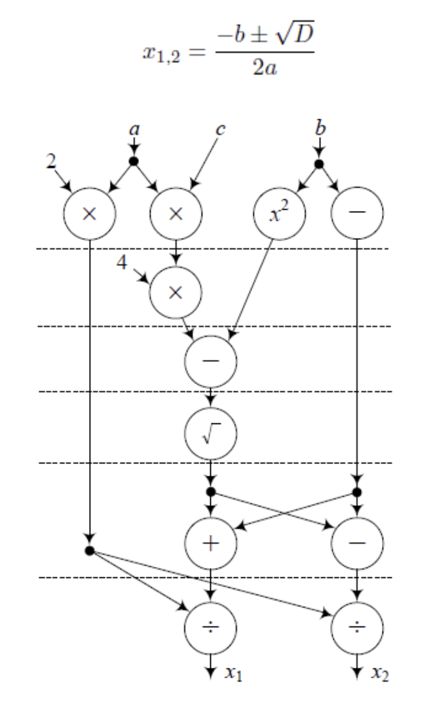

*Рис. 18. Решение корней квадратного уравнения.*

Также мы можем реализовать цикл, пример на рисунке 19.

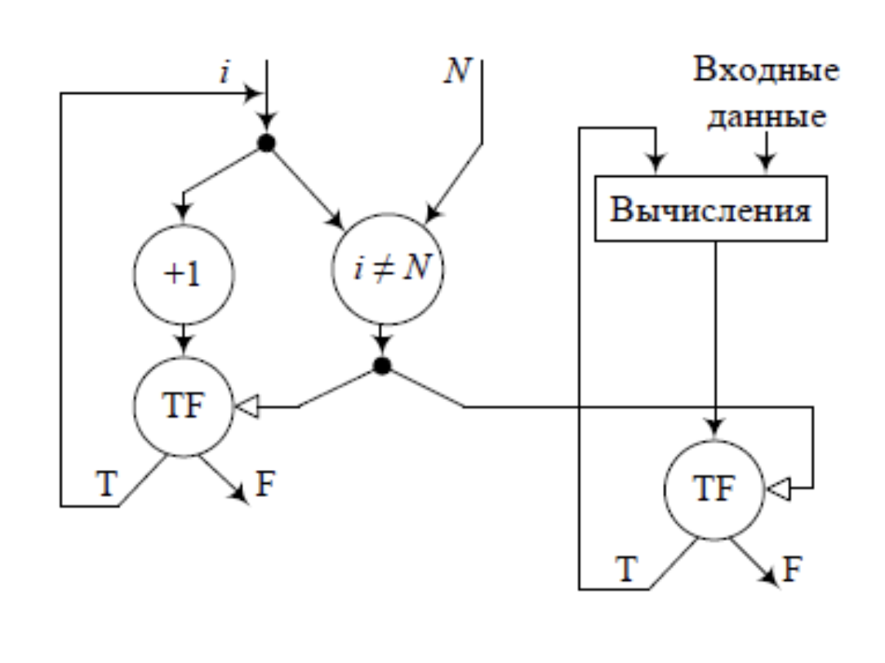

*Рис. 19. Цикл.*

Пример реализации такой системы представлен на рисунке 20. Она состоит из группы коммутаторов, блоков памяти и процессорных элементов. Одно прохождение по этому кругов данных соответствует одной линии, которая была представлена на рисунке 18.

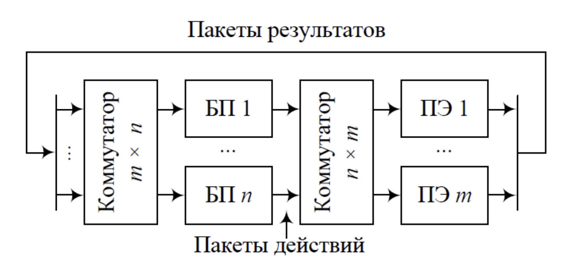

*Рис. 20. Пример реализации системы, управляемой потоками данных.*

## Основные материалы лекции
1. [Ссылка](https://www.youtube.com/watch?v=ew5WILrjK5A&list=PL0def37HEo5KHPjwK7A5bd4RJGg4djPVf&index=23) на видеозапись лекции
